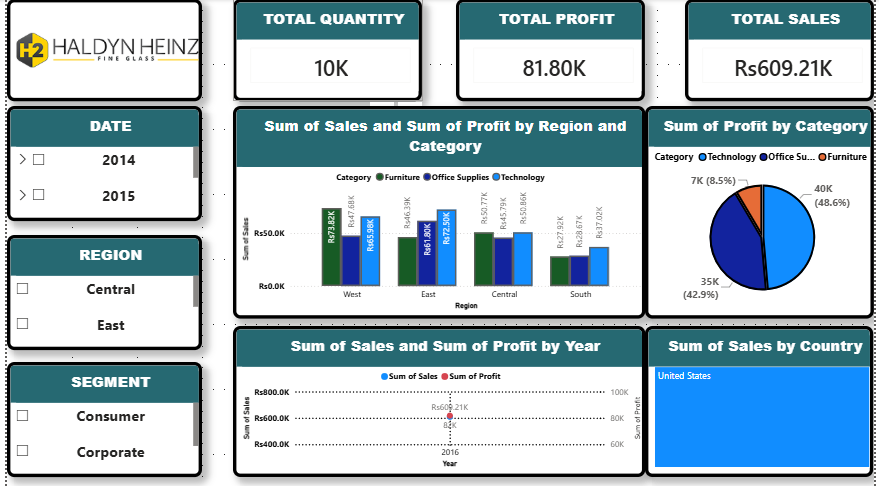
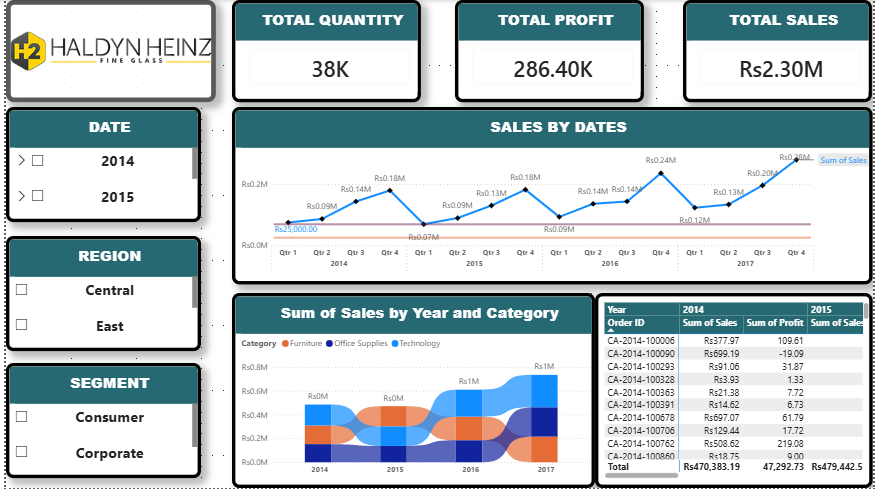
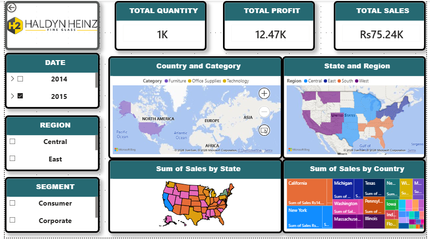
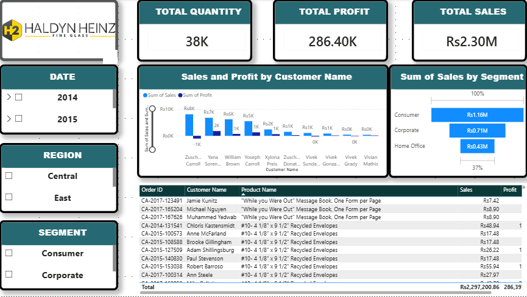

# Sales Analysis Report - Power BI Dashboard

A complete sales performance dashboard built in Power BI. This project analyzes sales, profit, trends, regional and customer data to provide business insights.

## 📁 Files in this Repo
- **sales Report.pbix** → The full Power BI dashboard file. Open with Power BI Desktop.
- **sales report.xlsx** → The raw dataset used to build the dashboard.
- **01_ to 07_ .png** → Screenshots of all 7 dashboard pages below.

## 🛠️ Tools & Skills Used
- Power BI Desktop
- DAX & Data Modeling
- Data Cleaning & Transformation
- Business Intelligence & Visualization

## 📊 Dashboard Screenshots

### 1. Welcome Page

### 2. Sales Overview

### 3. Profit Analysis

### 4. Time Series Analysis

### 5. Region-wise Analysis

### 6. Customer Analysis

### 7. Customer Details Analysis

