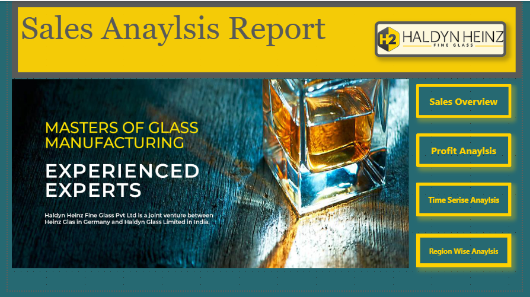
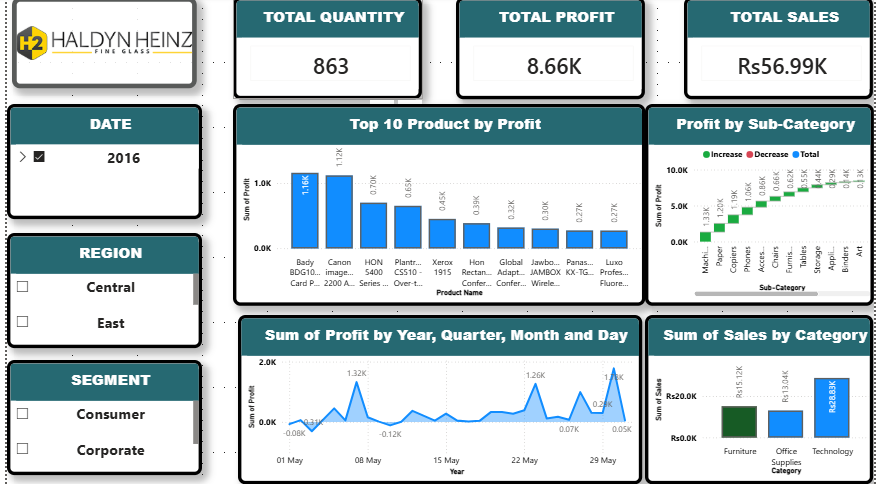
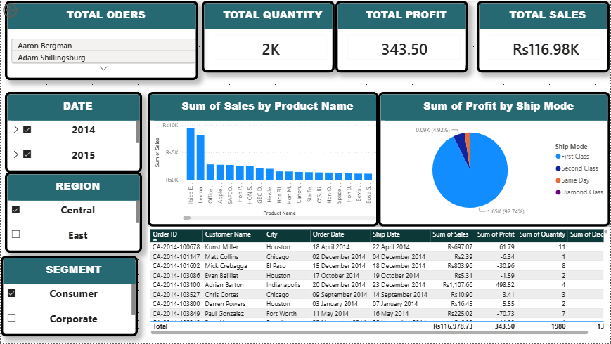

# Sales Analysis Report

Power BI dashboard for **Haldyn Heinz Fine Glass Pvt Ltd**  
*Masters of Glass Manufacturing*

## About This Project
This dashboard analyzes sales performance, profitability, and customer trends for Haldyn Heinz Fine Glass. The goal is to provide actionable insights for better business decisions.

## Dashboard Pages
- **Sales Overview**: Total sales, targets vs actuals, and key KPIs
- **Profit Analysis**: Profit by product category and region  
- **Time Series Analysis**: Monthly, quarterly, and yearly trends
- **Region-wise Analysis**: Performance breakdown by region
- **Customer Analysis**: Top customers and customer segments

## Tools & Skills Used
- **Tool**: Power BI Desktop
- **Data Source**: Excel / SQL
- **Skills**: Data Modeling, DAX, Data Visualization, Business Intelligence

## Dashboard Screenshots

### 1. Welcome

### 2. Sales Overview

### 3. Profit Analysis

### 4. Time Series Analysis

### 5. Customer Analysis

### 6. Customer Details

## How to Use
1. Download `sales Report.pbix` from this repo
2. Open it in Power BI Desktop to explore the interactive dashboard

---
Created by Allah Bachayo
